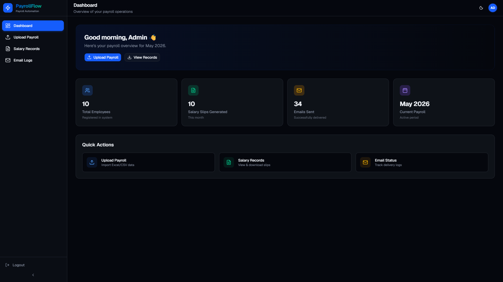
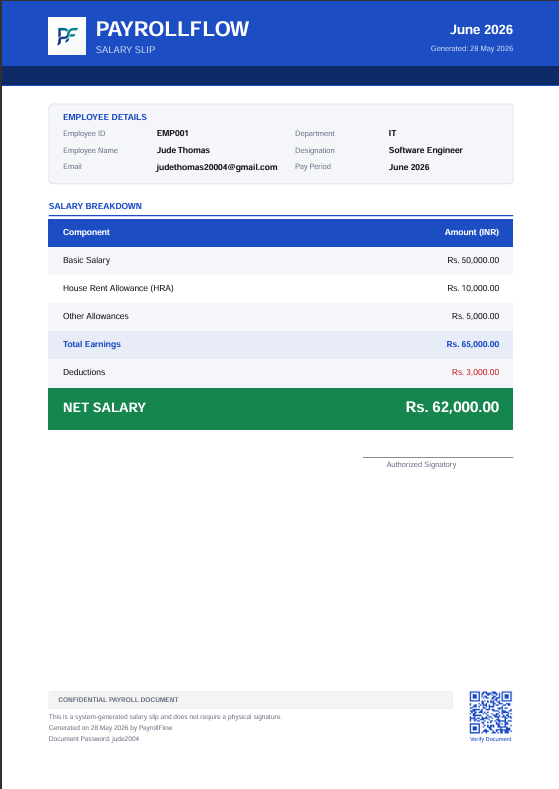

# ⚡ PayrollFlow — Salary Slip Automation Platform

PayrollFlow is a modern payroll automation system built to streamline employee salary processing workflows for HR and administrative teams.

The platform enables administrators to upload payroll sheets, validate employee salary data, generate professional password-protected salary slip PDFs, dispatch them via email, and track delivery status — all through a responsive SaaS-style dashboard.


---

## 🌐 Live Demo

> **https://payrollflow-toyota.vercel.app**

**Demo Credentials:**  
Email: `admin@payrollflow.com`  
Password: `admin123`

---

## ✨ Features

### Payroll Upload & Validation
- Upload payroll sheets using CSV or Excel (`.xlsx`, `.xls`) formats via drag-and-drop
- Automatic validation engine with 11+ rules covering missing fields, invalid emails, negative salaries, duplicate IDs, and malformed dates
- File type validation (MIME + extension check) and 5MB size limit to prevent malicious or oversized uploads
- Preview uploaded records in a searchable, paginated table before processing
- Enterprise-grade error handling: invalid rows are highlighted with specific error messages — the entire upload is never rejected

### Edit Before Save
- Inline edit modal for correcting employee data (name, email, salary components) before saving to the database
- Live salary recalculation as fields are modified — gross and net salary update instantly
- Delete individual rows from the preview if they should be excluded
- Recently-edited rows flash green with a "✓ Fixed" badge for visual confirmation
- Full re-validation runs automatically after every edit

### Dynamic Salary Slip Generation
- Generates professionally formatted A4 PDF salary slips using PDFKit
- Automatic salary calculations:
  ```
  Gross Salary = Base Salary + HRA + Allowances
  Net Salary   = Gross Salary - Deductions
  ```
- Password-protected PDFs for employee privacy (password = `firstname + birth year`)
- QR code verification embedded in each salary slip
- Company logo support for professional branding

### Automated Email Dispatch
- Sends salary slips directly to employee email addresses via Gmail SMTP
- Professional HTML email templates with personalized employee details
- Email delivery status tracking with sent, failed, and pending states
- **Retry failed emails** — single retry per employee or bulk "Retry All Failed" for batch recovery
- Rate limiting (max 50 emails per request) to prevent SMTP throttling

### Salary Records Management
- View all generated salary records with search and filtering
- Download individual salary slips as PDFs
- Download complete ZIP archives of all salary slips for a payroll period

### Operational Dashboard
- Modern SaaS-style dashboard with real-time statistics
- Employee count, salary slips generated, emails sent, and current payroll period at a glance
- Quick action cards for common workflows
- Email delivery analytics with success/failure rates

### Security & Route Protection
- Middleware-based route protection — all dashboard routes and API endpoints require authentication
- Cookie-based session management with 24-hour auto-expiry
- Protected API routes return `401 Unauthorized` for unauthenticated requests
- Input sanitization on all database operations to prevent XSS and injection attacks
- Environment variables for all sensitive credentials (never committed to source control)

### Responsive Design
- Fully optimized for desktop, tablet, and mobile usage
- Mobile sidebar drawer with slide-in animation and backdrop overlay
- Adaptive tables that intelligently hide non-essential columns on smaller screens
- Stacked button layouts on mobile for touch-friendly interaction
- Responsive padding and spacing that scales across breakpoints

---

## 📸 Application Screenshots

### Dashboard
<p align="center">
  
</p>

### Login Page
<p align="center">
  
</p>

### Payroll Upload & Validation
<p align="center">
  
</p>

### Salary Records
<p align="center">
  
</p>

### Email Logs & Retry System
<p align="center">
  
</p>

### Generated Salary Slip PDF
<p align="center">
  
</p>

### Mobile Responsive Layout
<p align="center">
  
  &nbsp;&nbsp;
  
  &nbsp;&nbsp;
  
</p>

---

## 📱 Why Responsive Design Matters

The platform was intentionally designed to be responsive because HR and payroll operations are not always performed from a desktop environment.

Administrators may need to quickly verify payroll records, check email delivery status, or access generated salary slips from mobile devices or tablets during operational workflows.

Instead of treating responsiveness as only a UI enhancement, the project approaches it as a **usability and accessibility improvement** for real-world administrative use cases.

The responsive strategy follows a **desktop-first, progressively enhanced** approach — the existing desktop layout is preserved completely, and mobile-specific adaptations are layered on top using Tailwind breakpoint utilities.

---

## 🔄 System Workflow

```
┌─────────────────────┐
│   Upload Payroll     │  ← CSV or Excel file
│   Sheet (.xlsx/.csv) │
└────────┬────────────┘
         ▼
┌─────────────────────┐
│   Validate Employee  │  ← 11+ validation rules
│   Data               │
└────────┬────────────┘
         ▼
┌─────────────────────┐
│   Preview & Edit     │  ← Fix errors inline
│   Payroll Records    │
└────────┬────────────┘
         ▼
┌─────────────────────┐
│   Save to Database   │  ← Supabase PostgreSQL
└────────┬────────────┘
         ▼
┌─────────────────────┐
│   Generate Salary    │  ← Password-protected
│   Slip PDFs          │    PDFs with QR codes
└────────┬────────────┘
         ▼
┌─────────────────────┐
│   Dispatch Emails    │  ← Gmail SMTP with
│                      │    HTML templates
└────────┬────────────┘
         ▼
┌─────────────────────┐
│   Track Delivery     │  ← Sent/Failed/Pending
│   Status             │    with retry support
└─────────────────────┘
```

---

## 🛠 Tech Stack

### Frontend
| Technology | Version | Purpose |
|-----------|---------|---------|
| Next.js | 16 (App Router, Turbopack) | Full-stack React framework |
| TypeScript | 5 | Type-safe development |
| Tailwind CSS | 4 | Utility-first styling |
| shadcn/ui | Latest | Professional component library |

### Backend
| Technology | Version | Purpose |
|-----------|---------|---------|
| Next.js API Routes | — | Server-side endpoints |
| Nodemailer | 8 | Gmail SMTP email delivery |
| PDFKit | 0.18 | Server-side PDF generation |
| QRCode | 1.5 | QR code generation for PDFs |

### Data & Storage
| Technology | Version | Purpose |
|-----------|---------|---------|
| Supabase | PostgreSQL | Cloud-hosted relational database |
| xlsx | 0.18 | Excel and CSV file parsing |
| JSZip | 3.10 | Bulk PDF download as ZIP |

### Infrastructure
| Technology | Purpose |
|-----------|---------|
| Vercel | Production hosting & deployment |
| Next.js Middleware | Route protection & auth |

---

## 📂 Project Architecture

```
payrollflow/
├── src/
│   ├── app/                        # Next.js App Router
│   │   ├── api/                    # Server-side API routes
│   │   │   ├── download/           #   └─ ZIP download endpoint
│   │   │   ├── email/
│   │   │   │   ├── send/           #   └─ Email dispatch endpoint
│   │   │   │   └── retry/          #   └─ Email retry endpoint
│   │   │   ├── salary/generate/    #   └─ PDF generation endpoint
│   │   │   ├── stats/              #   └─ Dashboard statistics
│   │   │   └── upload/             #   └─ Data upload & DB insert
│   │   ├── dashboard/              # Dashboard page
│   │   ├── emails/                 # Email logs & retry page
│   │   ├── login/                  # Authentication page
│   │   ├── records/                # Salary records page
│   │   ├── upload/                 # Upload & preview page
│   │   ├── globals.css             # Design system & animations
│   │   ├── layout.tsx              # Root layout with providers
│   │   └── page.tsx                # Entry redirect
│   ├── components/
│   │   ├── dashboard/              # Stat cards, dashboard widgets
│   │   ├── layout/                 # Sidebar, Header, AppShell
│   │   ├── shared/                 # Empty states, skeleton loaders
│   │   ├── ui/                     # shadcn/ui base components
│   │   ├── upload/                 # File dropzone, preview table, edit modal
│   │   └── theme-provider.tsx      # Dark/light mode provider
│   ├── lib/
│   │   ├── email.ts                # Nodemailer email service
│   │   ├── pdf.ts                  # PDFKit salary slip generator
│   │   ├── supabase.ts             # Supabase client instance
│   │   └── utils.ts                # Utility functions
│   ├── types/                      # TypeScript type definitions
│   ├── utils/
│   │   ├── parser.ts               # Excel/CSV file parser
│   │   ├── salary.ts               # Salary calculation engine
│   │   ├── sanitize.ts             # Input sanitization utilities
│   │   └── validation.ts           # 11-rule validation engine
│   └── middleware.ts               # Route protection middleware
├── public/
│   ├── demo-payroll.xlsx           # Sample payroll file
│   └── logo.png                    # Company logo for PDFs
└── package.json
```

---

## 🔐 Security & Privacy

| Layer | Implementation |
|-------|---------------|
| **Route Protection** | Middleware-based session checks on all protected routes |
| **API Security** | Unauthenticated API requests return `401 Unauthorized` |
| **PDF Privacy** | Password-protected salary slips (firstname + birth year) |
| **Input Sanitization** | HTML/script stripping on all database inputs |
| **Email Safety** | Rate limiting (50/request), name sanitization before HTML injection |
| **Credential Management** | All secrets stored in environment variables, `.env*` in `.gitignore` |
| **File Validation** | MIME type + extension + file size checks on uploads |
| **Session Management** | Cookie-based auth with 24-hour auto-expiry |

---

## ⚡ Performance & Reliability

The application was optimized to provide smooth operational workflows even during larger payroll processing tasks.

| Optimization | Implementation |
|-------------|---------------|
| **Lazy Loading** | Heavy components (PreviewTable, EditRowModal) loaded on demand via `React.lazy()` |
| **Memoization** | `useMemo` on all filtered/paginated data; `useCallback` on event handlers |
| **Efficient Rendering** | Skeleton loaders during data fetches, optimistic UI updates |
| **Error Recovery** | Email retry system (single + bulk) for failed deliveries |
| **Data Integrity** | Delete-before-insert strategy prevents duplicate salary records |
| **External Packages** | PDFKit, QRCode, Nodemailer marked as `serverExternalPackages` for Turbopack compatibility |

---

## 📋 Excel Template Format

Your payroll upload file should contain the following columns:

| Column | Required | Example |
|--------|----------|---------|
| Employee ID | ✅ | EMP001 |
| Name | ✅ | Arjun Sharma |
| Email | ✅ | arjun@example.com |
| Designation | ❌ | Software Engineer |
| Department | ❌ | Engineering |
| Date of Birth | ❌ | 06-05-2004 |
| Base Salary | ✅ | 60000 |
| HRA | ❌ | 15000 |
| Allowances | ❌ | 8000 |
| Deductions | ❌ | 5500 |
| Month | ✅ | 6 |
| Year | ✅ | 2026 |

A demo payroll file is included at `public/demo-payroll.xlsx`.

### Salary Calculation

```
Gross Salary = Base Salary + HRA + Allowances
Net Salary   = Gross Salary - Deductions
```

### PDF Password Format

```
Password = firstname (lowercase) + birth year (4 digits)
Example:  arjun2004
Fallback: Employee ID (e.g., EMP001) if DOB is missing
```

---

## 🚀 Local Setup

### Prerequisites

- Node.js 18+
- npm 9+
- Supabase account ([supabase.com](https://supabase.com) — free tier)
- Gmail account with App Password ([Google App Passwords](https://myaccount.google.com/apppasswords))

### Installation

```bash
# Clone the repository
git clone https://github.com/Judethedude007/payrollflow.git
cd payrollflow

# Install dependencies
npm install

# Set up environment variables
cp .env.example .env.local
```

### Environment Variables

Create a `.env.local` file:

```env
# Supabase
NEXT_PUBLIC_SUPABASE_URL=your_supabase_project_url
NEXT_PUBLIC_SUPABASE_ANON_KEY=your_supabase_anon_key

# Gmail SMTP
EMAIL_USER=your_email@gmail.com
EMAIL_PASS=your_gmail_app_password
```

### Database Setup

Run in your Supabase SQL Editor:

```sql
-- Employees table
CREATE TABLE employees (
  id SERIAL PRIMARY KEY,
  employee_id TEXT UNIQUE NOT NULL,
  name TEXT NOT NULL,
  email TEXT NOT NULL,
  designation TEXT DEFAULT '',
  department TEXT DEFAULT '',
  date_of_birth TEXT,
  created_at TIMESTAMP DEFAULT NOW()
);

-- Salary records table
CREATE TABLE salary_records (
  id SERIAL PRIMARY KEY,
  employee_id TEXT REFERENCES employees(employee_id),
  base_salary NUMERIC NOT NULL,
  hra NUMERIC DEFAULT 0,
  allowances NUMERIC DEFAULT 0,
  deductions NUMERIC DEFAULT 0,
  month TEXT NOT NULL,
  year TEXT NOT NULL,
  net_salary NUMERIC NOT NULL,
  created_at TIMESTAMP DEFAULT NOW()
);

-- Email logs table
CREATE TABLE email_logs (
  id SERIAL PRIMARY KEY,
  employee_id TEXT REFERENCES employees(employee_id),
  status TEXT DEFAULT 'pending',
  error_message TEXT,
  sent_at TIMESTAMP DEFAULT NOW()
);
```

### Run Development Server

```bash
npm run dev
```

Open [http://localhost:3000](http://localhost:3000) and login with:  
**Email:** `admin@payrollflow.com` | **Password:** `admin123`

---

## 🚢 Deployment

### Vercel (Recommended)

1. Push your code to GitHub
2. Connect the repository on [vercel.com](https://vercel.com)
3. Add environment variables in the Vercel dashboard
4. Deploy — Vercel auto-detects Next.js and configures the build

Supabase is cloud-hosted and requires no additional deployment steps.

---

## 🔮 Future Improvements

- Multi-admin role-based access control (Admin, HR Manager, Employee)
- Employee self-service portal for downloading own salary slips
- Advanced analytics dashboard with multi-month payroll comparison charts
- Scheduled payroll automation with cron-based email dispatch
- Cloud object storage (S3/Supabase Storage) for generated PDFs
- Tax calculation module (TDS, PF, ESI) for Indian payroll compliance
- Advanced audit logging for all administrative operations
- Mobile application using React Native

---

## 📄 License

This project was built as part of a Toyota internship program for educational and evaluation purposes.

---

<p align="center">
  Built with ❤️ using Next.js, TypeScript, Tailwind CSS, and Supabase
</p>
